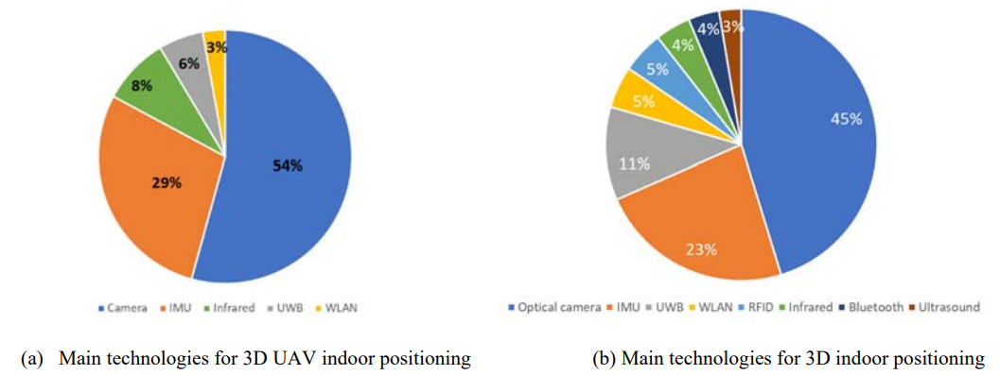
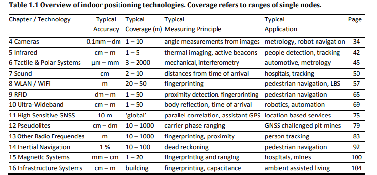
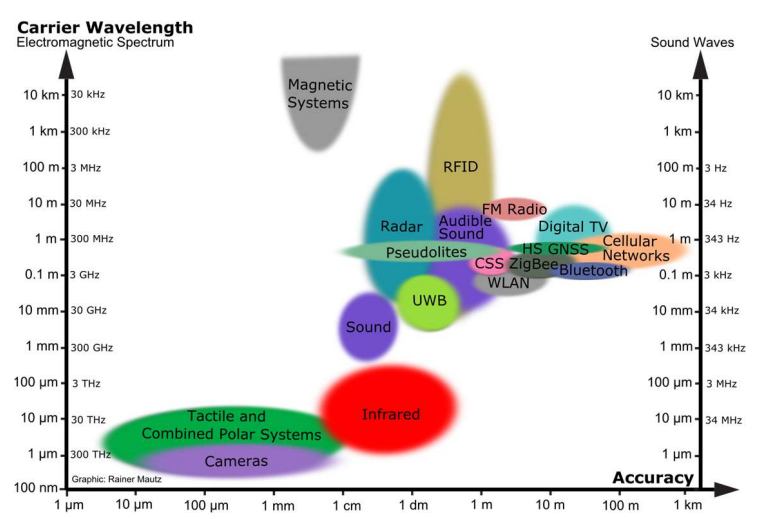
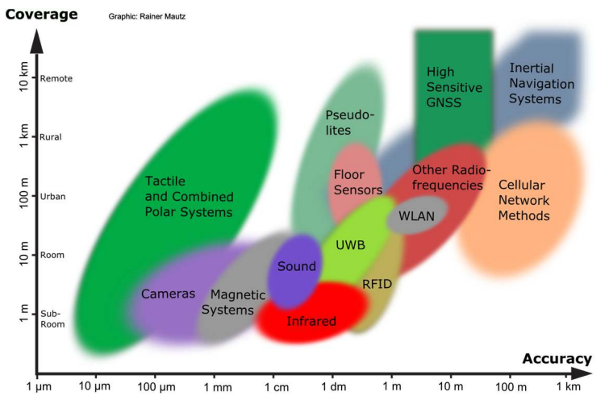

# Localization Sensors Guide for Robotics

## Introduction

Accurate localization is a cornerstone of modern robotics and autonomous systems. Any intelligent agent operating in a real-world environment—whether a mobile robot, self-driving car, or aerial drone—must continuously estimate its position and orientation to interact effectively with its surroundings. This capability enables fundamental tasks such as navigation, mapping, obstacle avoidance, and decision-making.

To achieve reliable localization, robots rely on a diverse set of sensors, each providing partial and often imperfect information about the environment or the system’s motion. Commonly used sensors include inertial measurement units (IMUs), global positioning systems (GPS), LiDAR, cameras, and wheel encoders. While each sensor has its own strengths, it also comes with inherent limitations, such as noise, drift, or environmental dependency.

A key challenge in robotics is therefore not only understanding how these sensors work individually, but also how to combine them effectively. This has led to the development of sensor fusion techniques, such as Kalman filtering and its variants, which aim to produce robust and accurate state estimates by integrating multiple data sources.

This repository is designed to provide a structured and practical exploration of localization sensors, focusing on both theoretical foundations and real-world applications. It aims to help students, researchers, and engineers build an intuitive and technical understanding of how different sensing modalities contribute to localization, particularly in indoor and outdoor environments.

In addition to conceptual explanations, this project includes implementation examples and is complemented by a dedicated video series to further support learning and practical insight.

## Related work

Here on we review the main characteristics of the technologies that are most employed in UAV localization
and show some related work. [1]

Below table characterizes	the	sensor technologies	at high‐level. The	values	specified for	accuracy and coverage	are	given	in form	of intervals wherein	most approaches reside.	There	are	many exceptions exceeding	these	intervals. Similarly, only the	main measuring principles and applications are mentioned in the table. [2]

A graphical overview in dependence of	accuracy and coverage is given in	below Figure

As can be seen from below Figure a large part of the electromagnetic spectrum can	be exploited for indoor	positioning. High	accuracy systems tend	to employ shorter wavelengths.	

[1] D. Gualda, J.de Vicente, J.M. Villadangos, and J. Ureña M.C. Pérez, "Review of UAV positioning in indoor environments and new proposal based on US measurements,".

[2] R. Mautz, "Indoor positioning technologies," Habilitation Thesis 2012.
