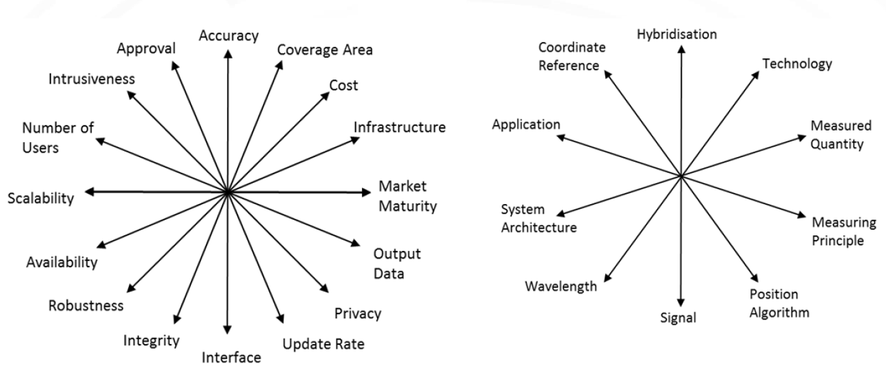

# Localization Sensors Guide for Robotics

## Introduction

Accurate localization is a cornerstone of modern robotics and autonomous systems. Any intelligent agent operating in a real-world environment—whether a mobile robot, self-driving car, or aerial drone—must continuously estimate its position and orientation to interact effectively with its surroundings. This capability enables fundamental tasks such as navigation, mapping, obstacle avoidance, and decision-making.

To achieve reliable localization, robots rely on a diverse set of sensors, each providing partial and often imperfect information about the environment or the system’s motion. Commonly used sensors include inertial measurement units (IMUs), global positioning systems (GPS), LiDAR, cameras, and wheel encoders. While each sensor has its own strengths, it also comes with inherent limitations, such as noise, drift, or environmental dependency.

A key challenge in robotics is therefore not only understanding how these sensors work individually, but also how to combine them effectively. This has led to the development of sensor fusion techniques, such as Kalman filtering and its variants, which aim to produce robust and accurate state estimates by integrating multiple data sources.

This repository is designed to provide a structured and practical exploration of localization sensors, focusing on both theoretical foundations and real-world applications. It aims to help students, researchers, and engineers build an intuitive and technical understanding of how different sensing modalities contribute to localization, particularly in indoor and outdoor environments.

In addition to conceptual explanations, this project includes implementation examples and is complemented by a dedicated video series to further support learning and practical insight.

## Related work

Here on we review the main characteristics of the technologies that are most employed in UAV localization
and show some related work [1].

Below table characterizes	the	sensor technologies	at high‐level. The	values	specified for	accuracy and coverage	are	given	in form	of intervals wherein	most approaches reside.	There	are	many exceptions exceeding	these	intervals. Similarly, only the	main measuring principles and applications are mentioned in the table [2].

A graphical overview in dependence of	accuracy and coverage is given in	below Figure [2].

As can be seen from below Figure a large part of the electromagnetic spectrum can	be exploited for indoor	positioning. High	accuracy systems tend	to employ shorter wavelengths [2].	

The	following	list of	different parameters can	be	used	as	a	basis	for	assessment	and	comparison of different indoor positioning systems. Due	to the large number of criteria, it is not straightforward	for	a	user	to	identify	the	optimal	system	for	a	particular	application. below Figure illustrates	the	complexity	and	multi‐dimensionality	of	the	optimization problem	confronting	the user.	For	each	application,	the	16 user	requirements	need	to	be	weighted	against	each	other.	The different	requirements	are	listed	below	with	some	example	values	given	in	brackets [2].

## 🌍 Applications of Localization in UAV Systems

### 1. Agriculture

Using unmanned aerial vehicles (UAVs), agricultural operators can perform **automated and targeted irrigation** in specific regions of farmland. This enables more efficient water usage and supports the growth of healthier and higher-quality crops. UAV-based localization allows precise positioning, which is essential for tasks such as precision spraying, field monitoring, and autonomous irrigation planning.

### 2. Applications in Art and Visualization

UAVs can be used for creating and displaying shapes, patterns, and text in the air, enabling large-scale aerial visual presentations. In indoor environments, drones are also utilized to generate dynamic visual effects and interactive installations, contributing to immersive and aesthetically engaging spaces.

### 3. Mapping and Surveying

UAVs are widely used for mapping and surveying different types of terrain. By using drones, the time required for data collection is significantly reduced, while the accuracy and resolution of generated maps are improved. This makes UAV-based mapping an efficient solution for large-scale environmental monitoring and geospatial analysis.

### 4. Warehousing and Logistics

UAVs can be used in warehouses for tracking goods and personnel. By leveraging accurate localization systems, drones enable efficient inventory monitoring, asset tracking, and real-time supervision of warehouse operations, improving overall logistics efficiency and safety.

### 5. Emergency Response and Search & Rescue

UAVs equipped with thermal imaging cameras provide an effective solution for detecting victims who are difficult to identify with the naked eye, making them highly valuable for emergency response teams. These drones can quickly scan large or inaccessible areas, improving the speed and efficiency of search and rescue missions.

In 2017, Land Rover, in collaboration with the Austrian Red Cross, developed a specialized emergency vehicle equipped with a roof-mounted thermal imaging drone. This system includes an integrated landing platform that allows the UAV to safely land while the vehicle is in motion.

In addition, startups and universities are actively developing autonomous UAV systems specifically designed for search and rescue operations. With the continuous development of emergency infrastructure, UAVs have the potential to significantly increase survival rates in both rural and urban disaster scenarios worldwide.

### 6. Disaster Prevention and Humanitarian Assistance

Beyond emergency response, UAVs have proven highly effective in natural disaster scenarios. Following events such as hurricanes and earthquakes, drones are used for damage assessment, victim localization, and delivery of essential aid to affected areas. In some cases, they also contribute to early-stage disaster mitigation and situational awareness.

For example, in 2017, UAVs were deployed to support recovery efforts after Hurricane Harvey. They were used to assess flood damage, identify affected regions, and assist in search and rescue operations. Such applications demonstrate the critical role of UAVs in improving disaster response efficiency and supporting humanitarian efforts worldwide.

### 7. Healthcare and Medical Delivery

UAVs are increasingly being explored for healthcare applications, particularly in medical logistics and emergency delivery systems. For example, Flirtey, a startup in the aerial delivery space, focuses on transporting medical supplies such as medicines using drones.

These systems have the potential to significantly improve access to healthcare in remote or hard-to-reach areas by enabling fast and reliable delivery of critical medical resources.

### 8. Wildlife Conservation and Animal Protection

Illegal hunting and climate change have a significant impact on global wildlife populations. According to the World Wildlife Fund (WWF), thousands of species face extinction each year. To address this issue, conservationists are adopting innovative technologies to monitor and protect ecosystems.

In combination with satellite imagery, UAVs are now widely used for wildlife monitoring and animal tracking. For example, researchers at the University of Liverpool are developing autonomous drone systems capable of tracking endangered species and transmitting real-time data about their health and behavior to researchers.

These technologies provide valuable tools for improving conservation efforts and supporting biodiversity preservation worldwide.

### 9. Transportation and Delivery

Although drone-based transportation and delivery systems are still under active development, they represent a potentially transformative technology for the future. UAVs can be used for delivering a wide range of items, such as food, mail, and small packages, through automated and pre-planned flight paths.

These systems have the potential to significantly improve delivery speed, reduce traffic congestion, and enable efficient logistics in both urban and remote areas.

### 10. Rescue Operations and Emergency Healthcare Support

Search and rescue operations are often time-critical, requiring fast and reliable decision-making. UAVs equipped with thermal imaging sensors can significantly assist in locating missing persons, especially in low-visibility conditions such as nighttime or complex environments.

These drones are particularly useful in challenging terrains where human access is limited or dangerous. By quickly identifying the location of individuals in distress, UAVs can greatly improve the efficiency of rescue missions and increase the chances of timely intervention.

### 11. Law Enforcement and Public Safety

UAVs have significant potential in law enforcement applications due to their ability to monitor large areas efficiently while maintaining a low operational profile. These systems can support surveillance and public safety monitoring with minimal public disturbance.

In emergency situations, drones can assist in crowd monitoring, detection of suspicious or illegal activities, and rapid situational awareness. They are also widely used in crime scene investigation, where aerial perspectives provide additional spatial information and improve the analysis of complex environments.

Overall, UAVs enhance law enforcement capabilities by improving monitoring efficiency, reducing response time, and enabling more effective data collection in critical situations.

### 12. Aerial Photography and Videography

This is one of the earliest and most well-known applications of UAVs. With advancements in technology, modern drones are often equipped with high-quality and sometimes heavy camera systems, enabling stable and high-resolution aerial imaging. These systems allow users to capture aerial views of specific locations and follow designated targets, making them highly valuable for filmmaking, media production, mapping, and recreational photography.

### 13. Defense and Security Monitoring

National defense operations often require regular surveillance of potentially dangerous or sensitive areas to ensure public safety and infrastructure protection. UAVs can significantly reduce the need for manual inspections in hazardous environments while providing a broader and more comprehensive field of view.

By using drones, security forces can minimize human exposure to risk and avoid unnecessary disruption to civilian life, as personnel do not need to physically enter dangerous regions. This makes UAVs an efficient tool for continuous monitoring and situational awareness in defense applications.

### 14. Bomb Detection and Hazard Inspection

Due to their small size and high maneuverability, UAVs can access confined or hard-to-reach spaces that are dangerous for humans. Many drones are also equipped with high-resolution cameras and sensing equipment, making them suitable for detecting potential explosive devices or hazardous objects.

These capabilities enable UAVs to support bomb detection and hazard inspection tasks by providing real-time visual information, helping authorities locate threats and reduce risks to human life during critical operations.

### 15. Advertising and Marketing

UAVs can be used as physical platforms for advertising and marketing purposes. They are capable of delivering aerial advertisements in live events or high-traffic locations, providing a dynamic and attention-grabbing medium for promotional content.

These systems enable innovative marketing strategies by creating visually engaging aerial displays and enhancing brand visibility in both indoor and outdoor environments.

[1] D. Gualda, J.de Vicente, J.M. Villadangos, and J. Ureña M.C. Pérez, "Review of UAV positioning in indoor environments and new proposal based on US measurements,".

[2] R. Mautz, "Indoor positioning technologies," Habilitation Thesis 2012.
